# Gamers Nest

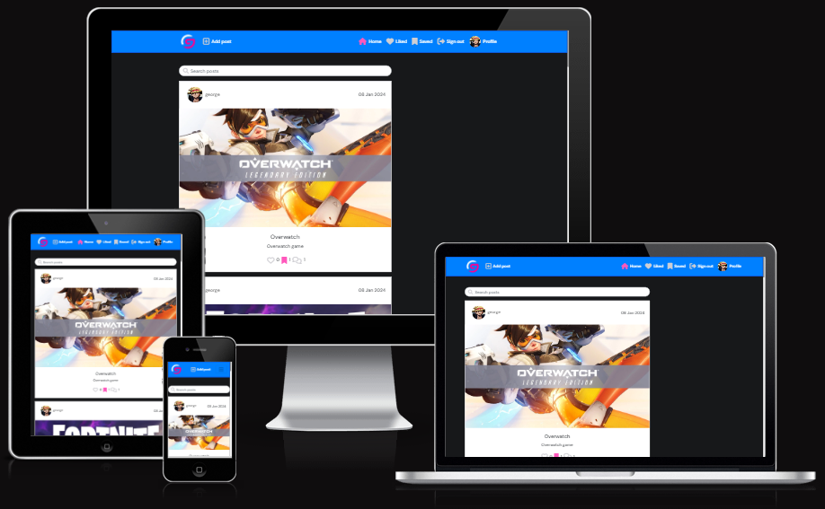
## Project goals
Gamers Nest is for all people who are interested in gaming, as you can:
1) Share Your Game Moments: Gamers Nest is where gamers like you can post about your gaming adventures! Share your wins, funny moments, or just chat about your favorite games.
2) Connect with Others: Like what others are posting? Give them a thumbs up and drop a comment. It's an awesome way to connect with fellow gamers and make new gaming buddies!
3) Find out what games are buzzing in the community. Get recommendations, tips, and tricks from other gamers. Who knows, you might discover your next favorite game!
4) Stay in the Loop: Your personalized gaming feed keeps you updated on what's happening. Don't miss out on cool posts or invites to game together.
5) Easy to Use: Gamers Nest is super easy to use. Whether you're a pro gamer or just starting, posting and chatting with others is a piece of cake.

Here is the link to the [Gamers Nest](https://gamers-nest-27823b8a37a8.herokuapp.com/) project

This is the repository for the React frontend of TribeHub.
The project also utilises a Django Rest Framework web API, the repository for which is located [here](https://github.com/GeorgeHazaka/drf-api-post)

## Table of contents

## Admin Credentials

- username: george
- password: password

## User stories
User stories and testing outcomes are documented in the `user_stories` worksheet of [this Google sheet](https://docs.google.com/spreadsheets/d/1TbuaklN0GnUuEC8N7yn4vkDDD2kgZLtuRsyB3VzDYZY/edit#gid=0)

## Design

### Flow Diagram

To structure and aid in creating the website, a basic flow diagram was created which is linked below.
[Flow Diagram](readme_assets/Gamers-Nest-Diagram---Wireframe-cc-Premium17049453506321704945349.pdf)

### Wirefremes

Please check below, a link to wireframes for the site layout.

[Wireframes](readme_assets/Gamers-Nest-Wireframes---Wireframe-cc-Premium17049436246261704943624.pdf)

### Colours

- Three main colours were used in this website. The colours are:'

  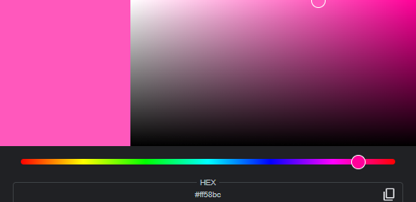
  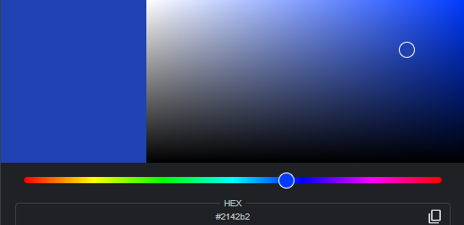
  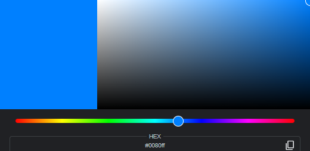

- Background color is

  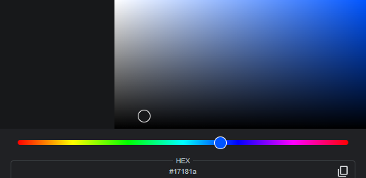

### Fonts
Google font is used for the project.
The font is (DM Sans)[https://fonts.google.com/specimen/DM+Sans?query=DM+]

## Features

### Existing Features

- #### The Header

  - Featured at the top of the page, the header shows the main headining of the website.
  - The navigation links are: 
    1. When user is logged in: Profile, Sign out, Saved, Liked, Home and Add post.
    
    2. When the user is NOT logged in: Sign up, Sign in, Home
    

- #### The Section

- ##### Home Page
  - The Home page has a search bar at the top.
  - The Home page contains all the posts by all the users.

  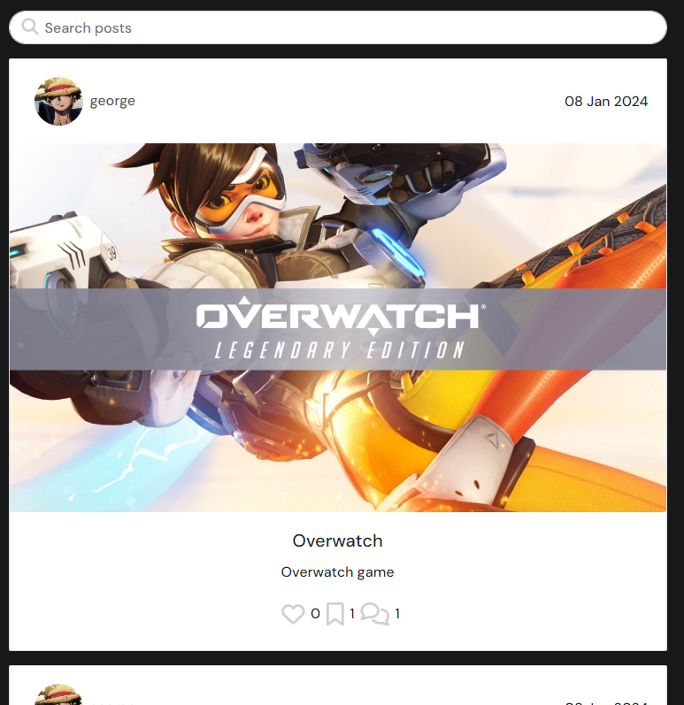
- #### Sign In Page
  - The Sign In page is where the user signs in.
  - The form contains Username and Password fields.

  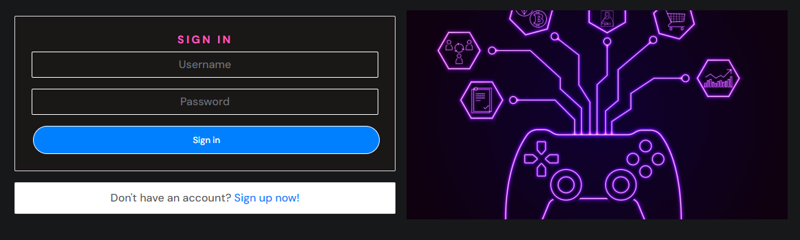
- #### Sign Up Page
  - The Sign Up page is where the user signs up
  - The form contains Username, Password and Confirm Password fields.

  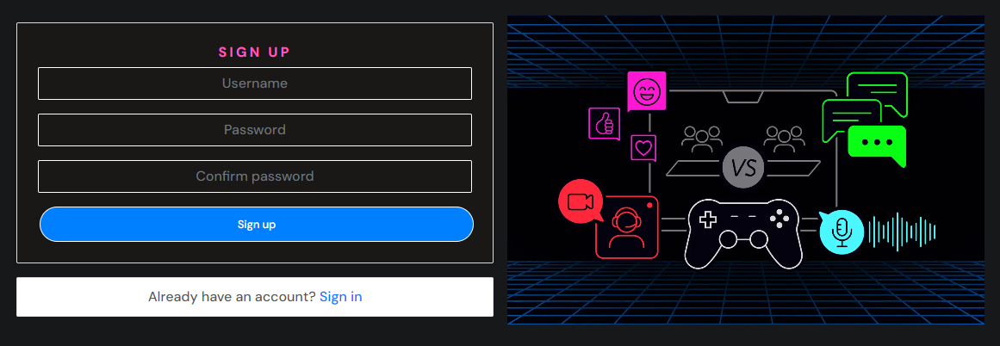
- #### Liked Page
  - The Liked page contains all the posts the user has liked.
  - The user can Not like his own posts.

  
- #### Saved Page
  - The Saved page contains all the posts the user has bookmarked.
  - The user can even bookmark his own post.

  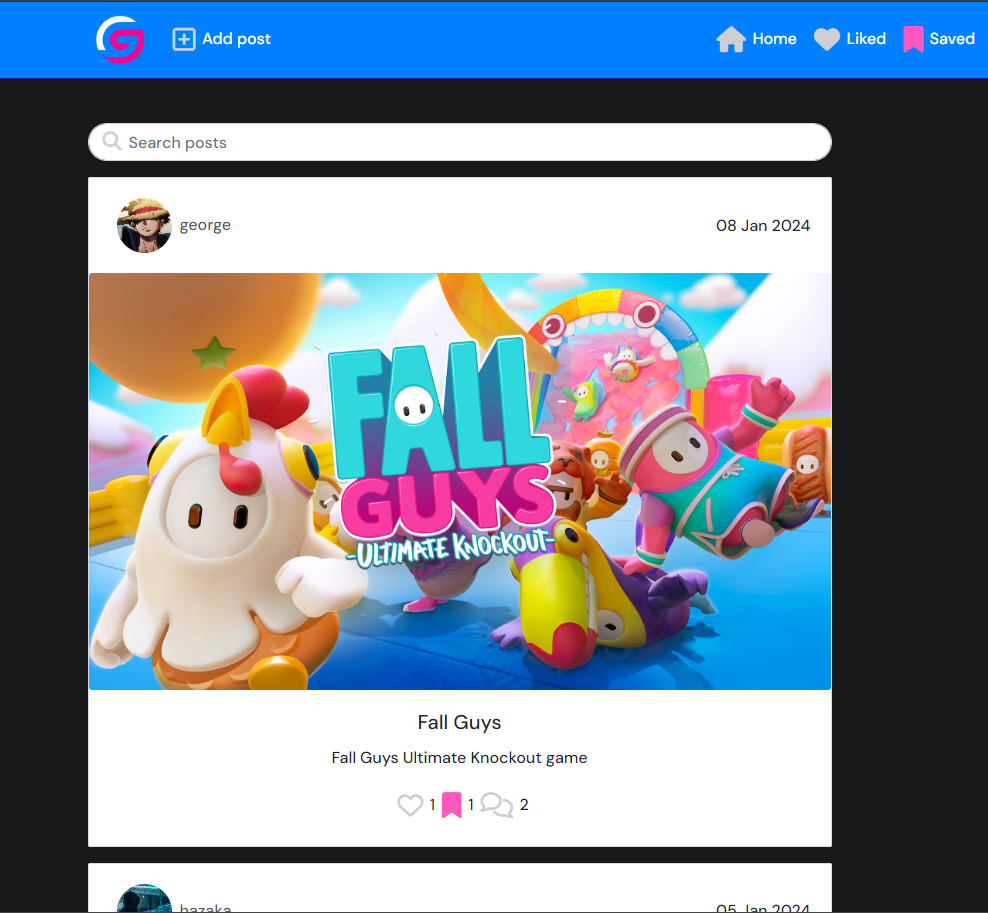
- #### Add Post Page
  - The Add Post page is where the user can create a post
  - The form contains: Title, Content and Image.

  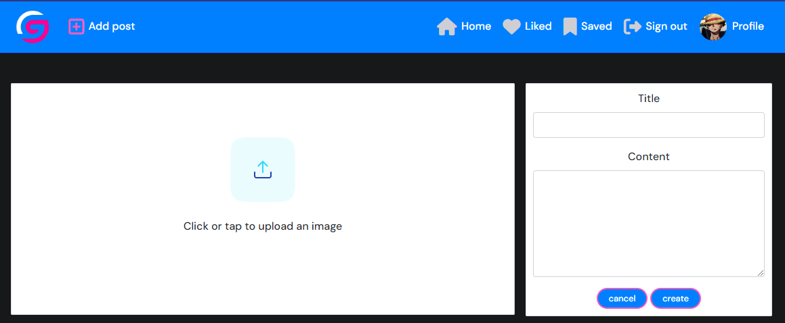
- #### Profile Page
  - The Profile page is where the user can a profile.
  - The user can edit his own profile if logged in.
  - The page contains: Profile name, bio, posts number, and all the post.

  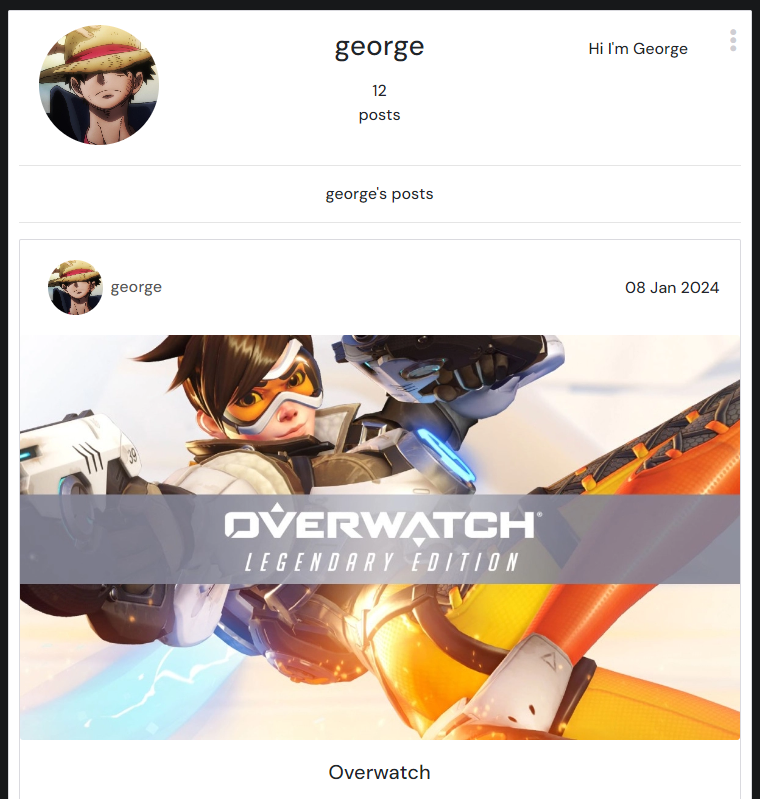
- #### Edit Profile Page
  - The Edit Profile page is where the user can edit their profile

  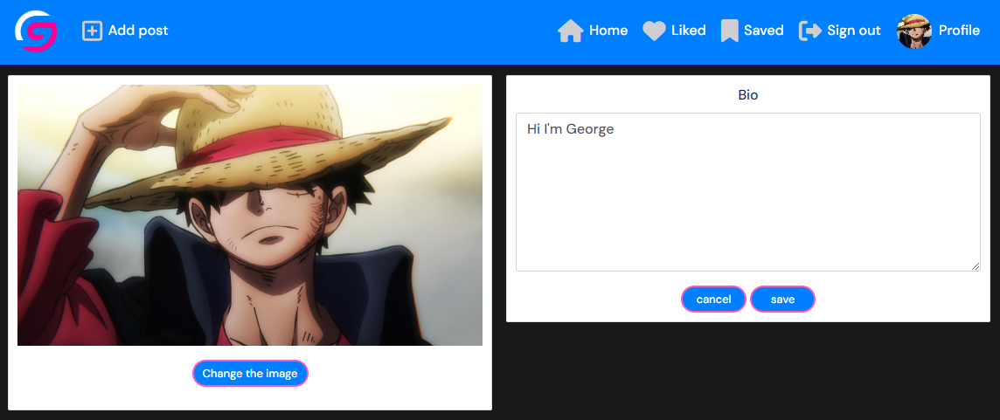
- #### Post Page
  - The Post page is where the user view a post.
  - The user can see a date of the post creation.
  - The user can like a post if logged in.
  - The user can see the amount of likes a post has.
  - The user can bookmark a post if logged in.
  - The user can comment on the post if logged in.
  - The user can see the amount of comments a post has.
  - The user can edit or delete the post if they own it.

  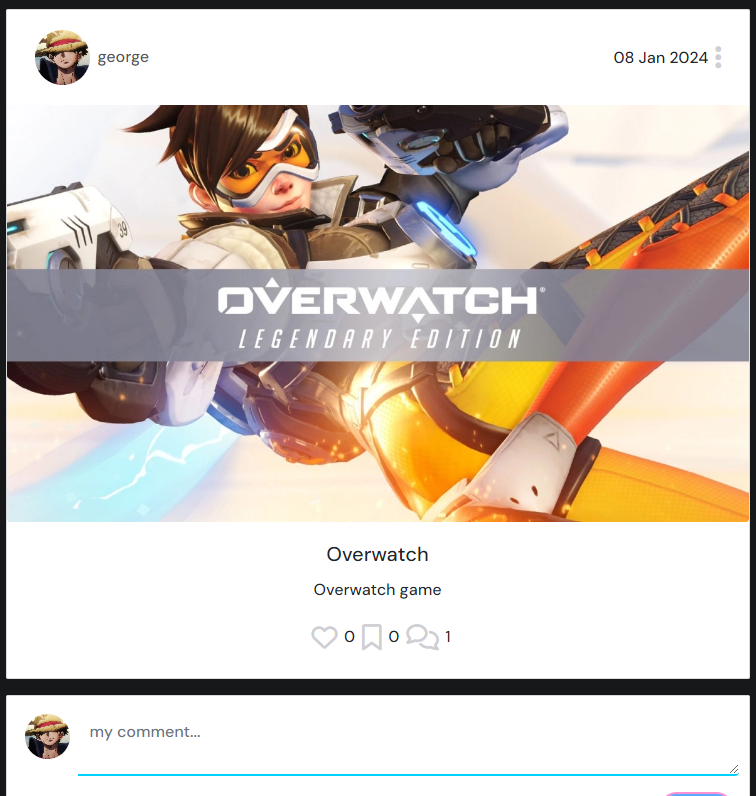
- #### Comment Section
  - The Comment section is where the user view the comments on a post.
  - The user can edit or delete his own comment.
  - The user can see a date of the comment creation.

  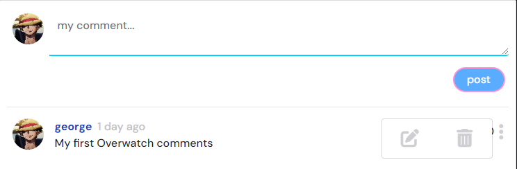

- #### Sign Out
 - When licked, the user will get signed out.
 - Then the user will be redirected to Home page.

- #### Navbar Toggler Button

  - It only appears when the user is using a device that has a width of 767 px or less.
    

  - When clicked, the navbar is shown, clicked again and navbar disappears.

    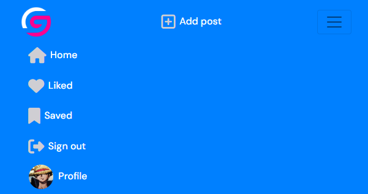

### Features Left To Implement

- Add followers section so that user can follow each other.
- Allow users to share a post with friends via other social medias.
- Allow users to vote on a games for various reasons.
- Add Live Streaming.
- Add a page where users can buy games from.

## User Experience

+ **User Story 001:** as a user I want to create an account.
  + **Tasks:** click on 'Sign up' button in the navbar, and fill the form, then click 'Sign Up' button located under the form.
+ **User Story 002:** as a user I want to log in to my account.
  + **Tasks:** click on 'Sign in' in the navbar, and fill the form, then click 'Sign In' button located under the form.
+ **User Story 003:** as a user I want to go th the Home page.
  + **Tasks:** click on 'G' logo, or click on 'Home' in the navbar.
+ **User Story 004:** as a user I want to create a post.
  + **Tasks:** click on 'Add post' in the navbar and fill the form.
+ **User Story 005:** as a user I want to edit a post.
  + **Tasks:** click on the Three Dots on the right side of each post you own. Then click on the Edit icon.
+ **User Story 006:** as a user I want to delete a post.
  + **Tasks:** click on the Three Dots on the right side of each post you own. Then click on the Delete icon.
+ **User Story 007:** as a user I want to like a post.
  + **Tasks:** click on the Heart icon located in the bottom of any post.
+ **User Story 008:** as a user I want to unlike a post.
  + **Tasks:** click on the Heart icon again.
+ **User Story 009:** as a user I want to bookmark a post.
  + **Tasks:** click on the Bookmark icon located in the bottom of any post.
+ **User Story 010:** as a user I want to remove bookmark on a post.
  + **Tasks:** click on the Bookmark icon again.
+ **User Story 011:** as a user I want to comment on a post.
  + **Tasks:** click on the Comment icon located in the bottom of any post.
+ **User Story 012:** as a user I want to like a comment on a post.
  + **Tasks:** click on the Heart icon located in the right of any comment.
+ **User Story 013:** as a user I want to unlike a comment on a post.
  + **Tasks:** click on the Heart icon again.
+ **User Story 014:** as a user I want to edit a comment on a post.
  + **Tasks:** click on the Three Dots on the right side of each comment you own. Then click on the Edit icon.
+ **User Story 015:** as a user I want to delete a comment on a post.
  + **Tasks:** click on the Three Dots on the right side of each comment you own. Then click on the Delete icon.
+ **User Story 016:** as a user I want to see my liked posts.
  + **Tasks:** click on 'Liked' button in the navbar.
+ **User Story 017:** as a user I want to see my bookmarked posts.
  + **Tasks:** click on 'Saved' button in the navbar.
+ **User Story 017:** as a user I want to view a profile detaills.
  + **Tasks:** click on any user's profile located in the posts.
+ **User Story 018:** as a user I want to edit my profile detaills.
  + **Tasks:** click on the 'Profile' button in the navbar, then click on the Three Dots, choose Edit Profile.
+ **User Story 019:** as a user I want to change my Username.
  + **Tasks:** click on the 'Profile' button in the navbar, then click on the Three Dots, and choose Change Password.
+ **User Story 020:** as a user I want to change my Password.
  + **Tasks:** click on the 'Profile' button in the navbar, then click on the Three Dots, and choose Change Password.
+ **User Story 021:** as a user I want to sign out.
  + **Tasks:** click on the 'Sign out' button located in the navbar.
+ **User Story 022:** as a user I want to search for a post.
  + **Tasks:** click on the Search bar at the top, and write the desired keywords.

## Testing

- I have tested that the site works in different browsers: Firefox, Brave, Chrome, Microsoft Edge.
- I confirm that all inputs and buttons work properly.

### Manual Testing

- #### Navbar Buttons Testing

    | Feature          | When The Following Is Done | Expect | Action | Result |
    | ---------------- | ------ | ------ | ------ | ------ |
    | **G-Logo**      | G-logo button is clicked | Directs to Home page | Clicked G-logo button | Directed to Home page |
    | **Home**        | Home button is clicked | Directs to Home page | Clicked Home button | Directed to Home page |
    | **Sign in**   | Sign in is clicked | Directs to Sign in page | Clicked Sign in button | Directed to Sign in page |
    | **Sign up**   | Sign up is clicked | Directs to Sign up page | Clicked Sign up button | Directed to Sign up page |
    | **Liked**   | Liked is clicked | Directs to Liked page | Clicked Liked button | Directed to Liked page |
    | **Saved** | Saved button is clicked | Directs to Saved page | Clicked Saved button | Directed to Saved page |
    | **Sign out** | Sign out button is clicked | Signs user out and redirects to Home page | Clicked Sign out button | Signed user out and reirected to Home page |
    | **Profile** | Profile button is clicked | Directs to Profile page | Clicked Profile button | Directed to Profile page |
    | **Add post** | Add post button is clicked | Directs to Post Create page | Clicked Add post button | Directed to Post Create page |

- #### Forms Testing

    | Feature          | When The Following Is Completed | Expect | Action | Result |
    | ---------------- | ------ | ------ | ------ | ------ |
    | **Sign Up**      | All fields are filled and Sign Up button is clicked | Creates account | Clicked Sign Up button | Account created |
    | **Sign In**      | All fields are filled and Sign In button is clicked | Logs in | Clicked Sign In button | Logged in |
    | **Add post**     | All fields are filled and Create button is clicked | Creates a post | Clicked Create button | Post Created |
    | **Edit post**    | All fields are filled and Save button is clicked | Updates the post | Clicked Save button | Post updated |
    | **Edit Profile** | All fields are filled and Save button is clicked | Updates the profile | Clicked Save button | profile updated |

- #### Sign In/Up Errors Testing

    | Feature          | When The Following Is Completed | Expect | Action | Result |
    | ---------------- | ------ | ------ | ------ | ------ |
    | **Sign In**      | Username and/or Password is/are wrong and clicks Sign In | Returns this message "Unable to log in with provided credentials" | Username and/or Password was/were wrong and clicked Sign In | Returned this message "Unable to log in with provided credentials" |
    | **Sign Up**      | The two password fields don't match and clicks Sign Up | Returns this message "The two password fields didn't match" | The two password fields didn't match and clicked Sign Up | Returned this message "The two password fields didn't match" |

- #### Post Testing

    | Feature          | When The Following Is Completed | Expect | Action | Result |
    | ---------------- | ------ | ------ | ------ | ------ |
    | **Like a post**       | Clicks Heart icon | Post will be liked and Likes amount + 1 | Clicked Heart icon | Post is liked and Likes amount + 1 |
    | **Bookmark a post**       | Clicks Bookmark icon | Post will be bookmarked | Clicked Bookmark icon | Post is bookmark |
    | **Comment on a post** | Clicks Comment icon, fill the form and clicks on Post | Comment will be created and Comments amount + 1 | Clicked Comment icon, filled the form and clicked on Post | Comment is created and Comments amount + 1 |
    | **Unlike a post**      | Clicks Heart icon again | Post will be unliked and Likes amount - 1 | Clicked Heart icon again | Post is unliked and Likes amount - 1 |
    | **Unbookmark a post**      | Clicks Bookmark icon again | Post will be bookmarked | Clicked Bookmark icon again | Post is unbookmarked |
    | **Like a comment**      | Clicks Heart icon | Comment will be liked | Clicked Heart icon | Comment is liked |
    | **Unlike a comment**      | Clicks Heart icon again | Comment will be unliked | Clicked Heart icon again | Comment is unliked |
    | **Edit a comment**      | Clicks Three Dots icon, chooses Edit icon and, fills the form and clicks on Save | Comment will be editted | Clicked Three Dots icon, chose Edit icon and, filled the form and clicked on Save | Comment is editted |
    | **Delete a comment**      | Clicks Three Dots icon and chooses Delete icon | Comment will be deleted | Clicked Three Dots icon and chose Delete icon | Comment is deleted |

### Validator Testing

- CSS: Passed the code through a [css validator](https://jigsaw.w3.org/css-validator/validator.html.en) and confirmed that no errors were found.
  - `index.css` No Errors.
  - `App.module.css` No Errors.
  - `Asset.module.css` No Errors.
  - `Avatar.module.css` No Errors.
  - `Button.module.css` No Errors.
  - `Comment.module.css` No Errors.
  - `CommentCreateEditForm.module.css` No Errors.
  - `MoreDropdown.module.css` No Errors.
  - `NavBar.module.css` No Errors.
  - `NotFound.module.css` No Errors.
  - `Post.module.css` No Errors.
  - `PostCreateEditForm.module.css` No Errors.
  - `PostsPage.module.css` No Errors.
  - `Profile.module.css` No Errors.
  - `ProfilePage.module.css` No Errors.
  - `SignInUpForm.module.css` No Errors.


### Unfixed Bugs
When Signin or Signup buttons are clicked, I get the following error in the console:
"POST https://drf-api-post-3b40e28fbca7.herokuapp.com/dj-rest-auth/token/refresh/ 401 (Unauthorized)"

## Deployment

----
This project was deployed using Code Institute's mock terminal for Heroku

- Steps for deployment:
  - Fork or clone this repository
    - To Fork:
        1. Log in or sign up to Github.
        2. Go to repository of this project, [YamYam Pizzeria](https://github.com/GeorgeHazaka/Yam-Yam-Pizza)
        3. Click the Fork button in the upper right corner
    - To Clone:
        1. Log in or sign up to Github.
        2. Go to repository of this project, [YamYam Pizzeria](https://github.com/GeorgeHazaka/Yam-Yam-Pizza)
        3. Click on Code button and delect to clone with either HTTPS, SSH or GITHub CLI and copy the link shown.
        4. Open the terminal in your code editor and change the working directory to the location you want to use for the cloned directory.
        5. Type this command in the terminal:
        ```bash
        git clone { & THE LINK FROM STEP 3 }
        ```
        6. Set up a virtual environment, but if you are using Code Institute Template in Gitpod then you can skip this step.
        7. Install the packages from the requirements.txt file by running the following command in the Terminal:

        ```bash
        pip3 install -r requirements.txt
        ```

  + Create a new Heroku app
  + Link the Heroku app to the repository
  + Click on **Deploy**

### Content
- The main code of Gamers Nest was taken from CodeInstitute [Moments Walkthrough Project](https://learn.codeinstitute.net/courses/course-v1:CodeInstitute+RA101+2021_T3/courseware/70a8c55db0504bbdb5bcc3bfcf580080/953cd4e5015f483bb05263db3e740e19/)

### Media
- All images were taken from open source sites and CodeInstitute [Moments Walkthrough Project](https://learn.codeinstitute.net/courses/course-v1:CodeInstitute+RA101+2021_T3/courseware/70a8c55db0504bbdb5bcc3bfcf580080/953cd4e5015f483bb05263db3e740e19/)